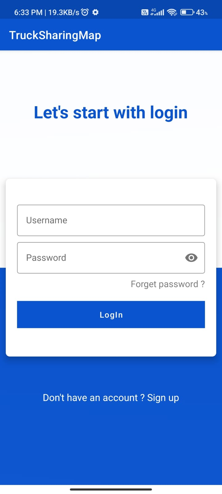
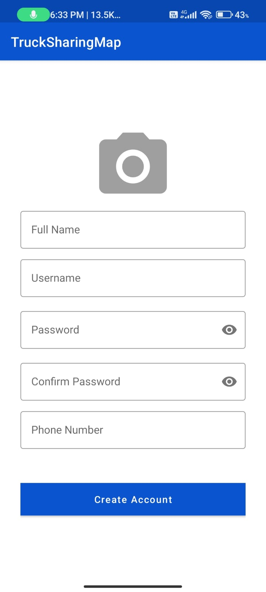
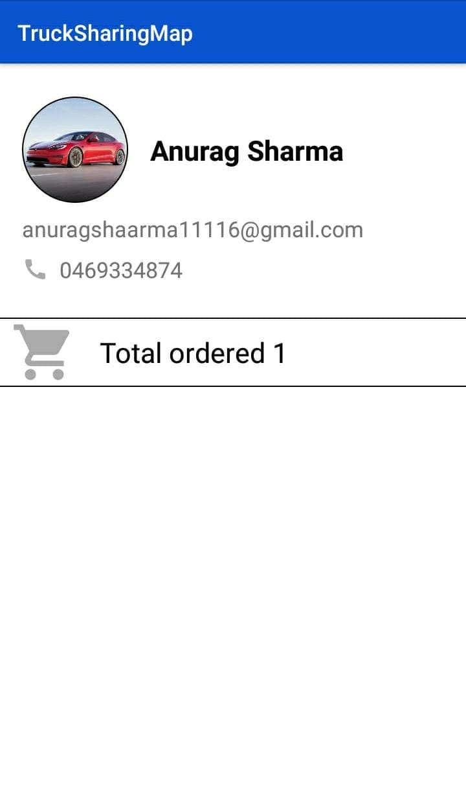
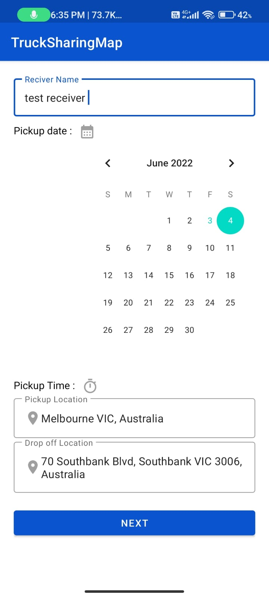
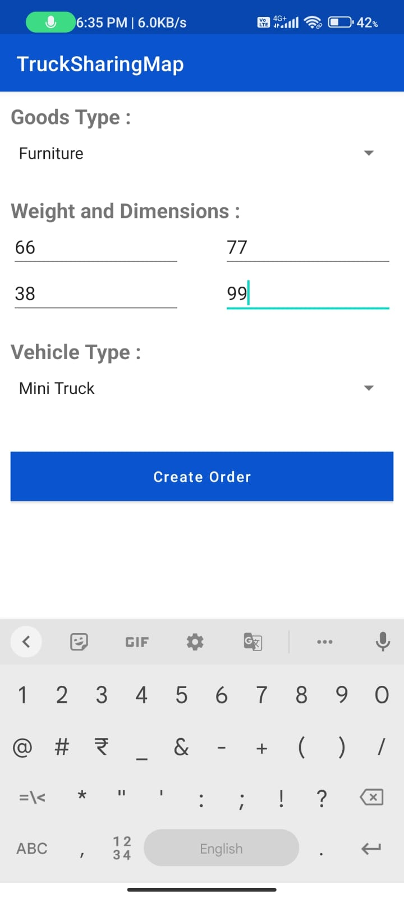
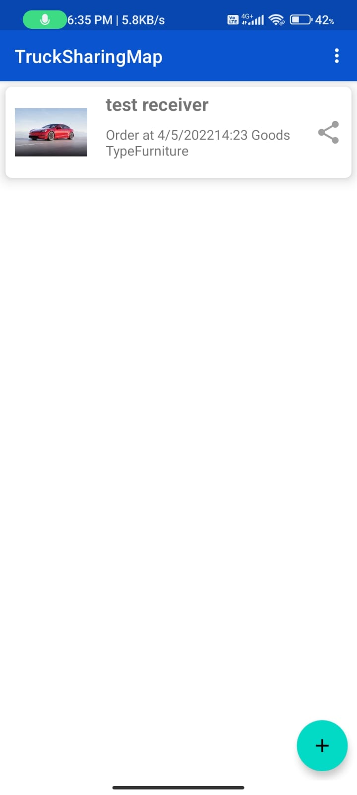
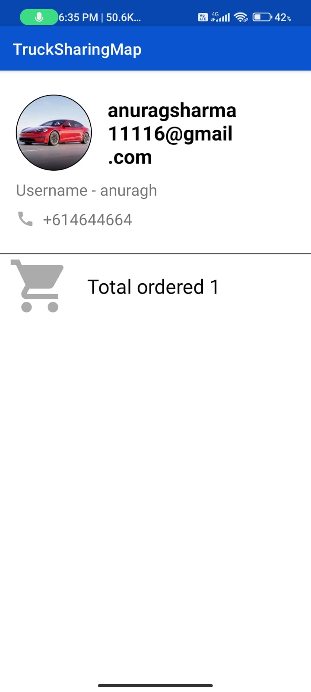
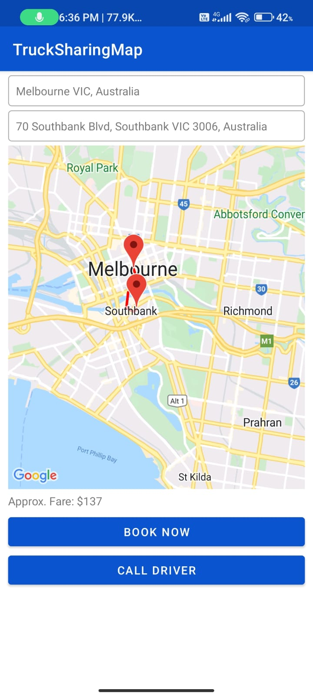
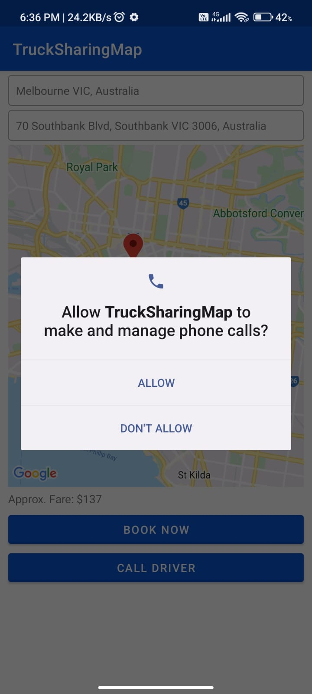

# Truck Sharing App 📲

**Truck Sharing App** is a mobile app that helps you find and book trucks to move your stuff.


### Screens💻

* User Registration
* User Login
* Create Order
* View Order
* View Profile
* Share Order Details on different social media platforms and apps
* View Locations on a map
* Payment Gateway
* **Controlling app throw Voice commands**
* Material Design UI

### Features 🌟
#### 👉User Registration
User can create account using username(unique),Full name,Image for profile picture and password.

Before creating account we are checking is username already exists or not and also password and confirm password should be same.

#### 👉User Login
User can login using username and password.

#### 👉Creating Order
User can create order by selecting the location,date and time and then in next screen user need to select truck type,weight and quantity. 

#### 👉Payment
User can pay for order using payment gateway GPay. He/She need gmail account for payment, once he loggedinto gmail he can add credit/debit card 💳 and pay for order.

Price will be calculated based on weight, quantity and distance.

During the payment user can also scan Credit/Debit card and pay for order without entering card details manually.

**👉Payment screen is restricted to take a screenshots or screen recording for security reason!!!**

#### 👉Storage 📦
We are using Local storage to store user data 📑.

#### 👉Voice Control
User can control the app using voice commands.
- **login**
- **sign up**
- **create account**
- **open my orders**
- **create new orders**
- **view my profile**
- **Go Back**

We are using **Google Speech Recognization** for voice control.
Code snippets:
```java
SpeechRecognition speechRecognition;
TextToSpeech tts;
tts = new TextToSpeech(this, new TextToSpeech.OnInitListener() {
            @Override
            public void onInit(int i) {

            }
        });
        tts.setLanguage(Locale.US);
        speechRecognition = new SpeechRecognition(this);
        speechRecognition.setSpeechRecognitionPermissionListener( this);
        speechRecognition.setSpeechRecognitionListener( this);
 
```

### Technologies / Libraries Used
* Android JAVA
* Local Database SQLite
* Google Maps & Places API  
    ```
    implementation com.google.android.gms:play-services-maps:18.0.2' 
    ```
    ```
     implementation com.google.maps.android:android-maps-utils:0.5' 
     ```
* Gpay API for Payment Gateway
    ``` 
    implementation 'com.google.android.gms:play-services-pay:16.0.3'
    implementation 'com.google.android.gms:play-services-wallet:19.1.0'
    ```

* Retrofit
```
    implementation 'com.squareup.retrofit2:retrofit:2.9.0'
    implementation 'com.squareup.retrofit2:converter-gson:2.9.0'
```

* Circle Image View
```
    implementation 'de.hdodenhof:circleimageview:3.1.0'
```

* Material Design
```
    implementation 'com.google.android.material:material:1.5.0'
```

### Screenshots:



 




